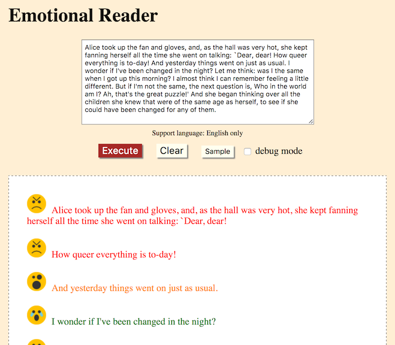

# Emotional Reader

Emotional Reader is a web service to split input text to sentences with emotional icons which are expressed by the sentences.

## How to use

1. git clone
2. npm install
3. npm start
4. Access to http://localhost:3000/

## Author

[shioyang](https://github.com/shioyang)
